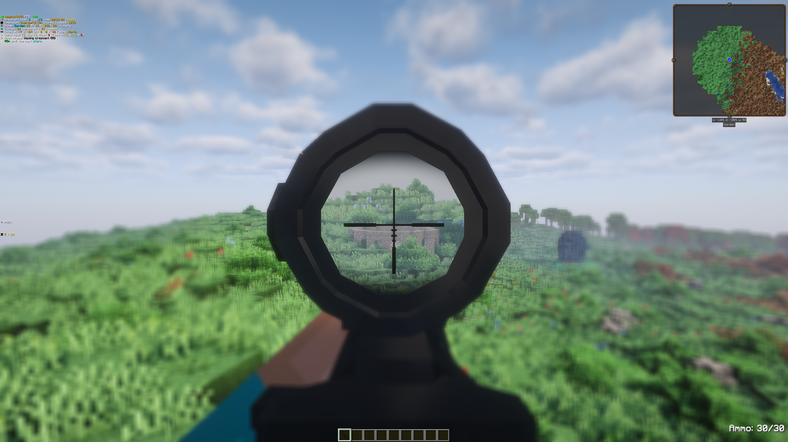
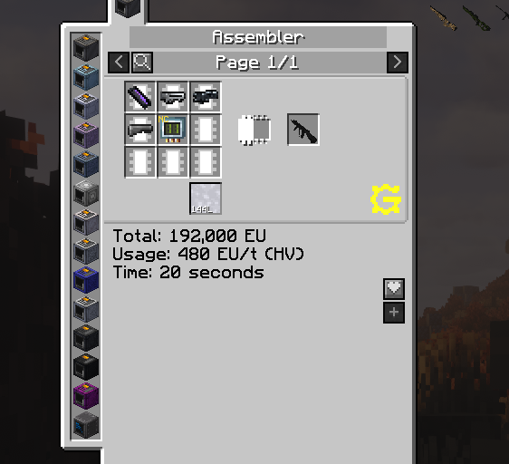
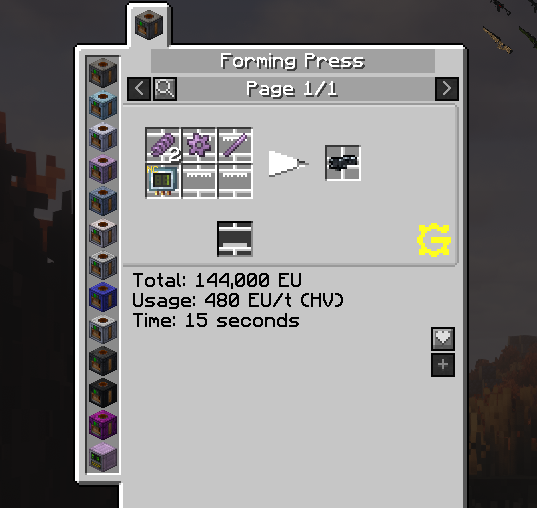
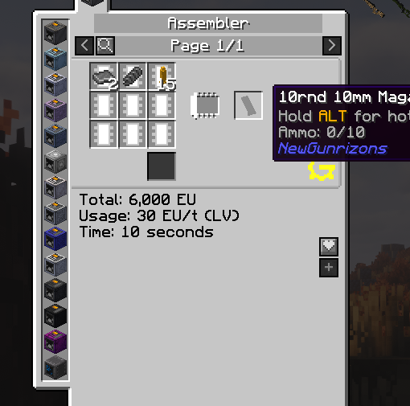

# NewGunrizons

A Minecraft 1.7.10 firearms mod for the [GT New Horizons](https://github.com/GTNewHorizons) modpack. NewGunrizons is a heavily modified fork of [**Vic's Modern Warfare**](https://github.com/vic4games/modern-warfare) (also known as Modern Warfare Mod / MWC), rebuilt from the ground up to integrate with GregTech and the GTNH ecosystem.

> **WARNING: This mod is built for GTNH 2.8.4 release.**
> It depends on specific versions of GT5-Unofficial (5.09.51.482), Angelica (1.0.0-beta66b), and GTNHLib (0.7.10) shipped with that release. It is **not guaranteed to work** with newer or older GTNH versions, as internal APIs and class structures may change between releases.

## Shader Compatibility

NewGunrizons should be compatible with Angelica's shader pipeline. Muzzle flash effects use Angelica's dynamic lighting system for real-time illumination when firing. Scope rendering works correctly with both shaders enabled and disabled.

## What Changed from Vic's Modern Warfare

This is not a simple config tweak — the mod has been extensively restructured and refactored.

- **Full refactor** of the internal codebase.
- **Everything unrelated to weapons was cut**.
- **Bug fixes and enhancements** for the original mod.
- **GregTech crafting integration** — all items are crafted exclusively through GT machines (Assembler, Forming Press). No vanilla crafting table recipes.
- **Tiered progression** — weapons are gated behind GregTech voltage tiers (LV through IV), requiring progressively advanced components
- **Custom component system** — gun barrels, receivers, stocks, firing mechanisms, bullet casings, and precision lenses are intermediate crafting ingredients made in GT machines

## Features

### Weapons

Over **100 firearms** spanning multiple eras and categories:

| Category | Count | Examples |
|----------|-------|---------|
| Assault Rifles & Carbines | 33 | AK-47, M4A1, G36, AUG, SCAR-H, AN-94 |
| Pistols & Machine Pistols | 20 | M1911, Glock-18, Desert Eagle, Luger P08, Makarov PM |
| SMGs & PDWs | 18 | MP5, P90, KRISS Vector, PPSh-41, MP-40 |
| Sniper & Marksman Rifles | 21 | AWP, Dragunov SVD, Barrett M107, Kar98K, Mosin Nagant |
| Shotguns & Heavy Weapons | 12 | Remington 870, SPAS-12, Saiga 12, M249 SAW, Mk153 SMAW |


### Attachments

- **Scopes & Sights** — ACOG, EOTech holographic, Reflex, Kobra, Leupold, PSO-1, OKP-7, PU scope, and more
- **Suppressors** — caliber-specific silencers for 9mm through .50 BMG
- **Grips** — angled grip, stubby grip, vertical foregrip, bipod
- **Lasers** — tactical laser sights

<!-- TODO: Add attachments screenshot -->


### Ammunition System

- **Realistic caliber system** — each weapon uses its specific ammunition type
- **Magazine-based reloading** — most weapons use detachable magazines that must be loaded with the correct bullet type
- **Three casing tiers** — small (pistol/SMG), medium (rifle), and large (.50 BMG) casings as crafting intermediates



### GregTech Integration

All crafting is done through GregTech machines — no crafting table recipes exist.

**Component crafting:**
- **Assembler** — gun barrels (plate + stick), stocks (wood/plastic/carbon), precision lenses, scopes, grips, suppressors, ammo, magazines, gun assembly
- **Forming Press** — receivers (plates), bullet casings (brass/steel), firing mechanisms, weapon part kits

**Weapon tiers:**

| Tier | EU/t | Components | Example Weapons |
|------|------|------------|-----------------|
| LV (30) | Steel barrel + Steel receiver + Wood stock | Luger P08, Kar98K, M1 Garand, STG-44 |
| MV (120) | Stainless barrel + Steel receiver + Plastic stock | MP-40, Glock-18, Desert Eagle, Remington 870 |
| HV (480) | Titanium barrel + Stainless receiver + Plastic stock | AK-47, M4A1, MP5, Dragunov |
| EV (1920) | TungstenSteel barrel + Titanium receiver + Carbon stock | SCAR-H, AK-12, Barrett M107, M249 |
| IV (7680) | TungstenSteel barrel + Titanium receiver + Carbon stock | M41A, SMAW |



## Building

```bash
# Build the mod jar
./gradlew build

# Output jar will be in build/libs/
```

## Controls

| Key         | Action |
|-------------|--------|
| Right Click | Aim Down Sights |
| Left Click  | Fire |
| R           | Reload |
| R-Shift     | Selective Fire (Semi/Burst/Auto) |
| M           | Attachment Mode |
| L           | Switch Laser |
| ] / [       | Zoom In / Out (while scoped) |

## Credits

- **Original mod**: [Vic's Modern Warfare](https://github.com/vic4games/modern-warfare) by Vic4Games — the foundation this mod was built upon
- **GT New Horizons team** — for the modpack and build toolchain

## License

This mod is a derivative work of Vic's Modern Warfare. Please refer to the original mod's license terms for redistribution and modification rights.
